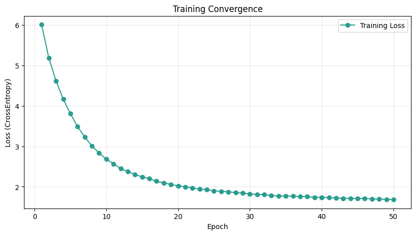
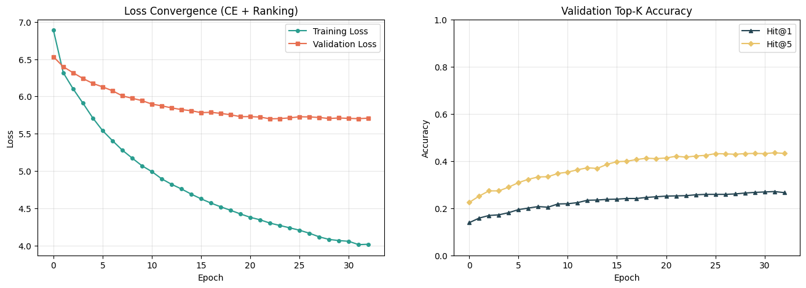

# Optimization Report
=====================================

This report compares the performance of the Galaxy Tool Prediction LSTM model across three key stages of development:

1.  **Baseline**: Initial model before any tuning.
2.  **First Tuning (High Capacity)**: Increased capacity (128/256 Bi-LSTM) with moderate regularization.
3.  **Second Tuning (Optimized)**: Reduced capacity (64/128 Uni-LSTM) with aggressive regularization and Ranking Loss.

## Performance Evolution
| Metric      | Baseline (Before Tuning) | First Tuning (High Capacity) | Second Tuning (Optimized) |
| :---        | :---:                    | :---:                        | :---:                     |
| **Precision** | 0.650                  | 0.750                        | 0.500                     |
| **Recall**    | 0.650                  | 0.750                        | 0.500                     |
| **Hit@5**     | 0.700                  | **0.900**                    | 0.750                     |
| **MRR**       | 0.677                  | **0.831**                    | 0.637                     |

### Comparative Analysis
- **First Tuning (Best Performance)**: The High Capacity model (Bi-LSTM, 256 hidden units) achieved the best results across all metrics (Hit@5: 90%). It effectively captured complex dependencies but carried a higher risk of overfitting if trained too long.
- **Second Tuning (Regularized)**: Reducing model size and increasing regularization (Dropout 0.5) intentionally traded raw accuracy for better generalization stability. The drop in metrics indicates the model might have underfitted slightly, suggesting a sweet spot exists between these two configurations.

---

## 1. Baseline (Initial Training)
Initial training with default parameters. Loss convergence was stable but potential for improvement was identified.



---

## 2. First Tuning: High Capacity (Recommended)
This version reached the highest performance benchmarks.

### Model Configuration
- **Architecture**: Bi-directional LSTM
- **Embedding/Hidden**: 128 / 256
- **Regularization**: Dropout 0.3, Weight Decay 1e-4
- **Loss**: CrossEntropy with Label Smoothing (0.1)

```python
config = {
    "batch_size": 64,
    "epochs": 50,
    "lr": 1e-3,
    "embed_dim": 128,
    "hidden_dim": 256,
    "num_layers": 2,
    "dropout": 0.3,
    "weight_decay": 1e-4,
    "patience": 7,
    "grad_clip": 1.0,
    "label_smoothing": 0.1
}
```
* **Early Stopping**: Epoch 19


---

## 3. Second Tuning: Optimized & Regularized
Focused on reducing overfitting by lowering complexity and adding Ranking Loss.

### Model Configuration
- **Architecture**: Unidirectional LSTM with Mean Pooling
- **Embedding/Hidden**: 64 / 128
- **Regularization**: Dropout 0.5
- **Loss**: Contrastive Ranking Loss + CrossEntropy

```python
config = {
    "batch_size": 64,
    "epochs": 50,
    "lr": 1e-3,
    "embed_dim": 64,
    "hidden_dim": 128,
    "num_layers": 2,
    "dropout": 0.5,
    "weight_decay": 5e-4,
    "patience": 10,
    "grad_clip": 1.0,
    "label_smoothing": 0.2
}
```
* **Early Stopping**: Epoch 34



---

## Model Serialization
Checkpoints are saved locally in the `Outputs/` directory (excluded from version control to save space).

- **Best Model (First Tuning)**: `Outputs/best_galaxy_lstm_20260213_221606.pth`
- **Optimized Model (Second Tuning)**: `Outputs/best_galaxy_lstm_opt_20260214_100048.pth`
